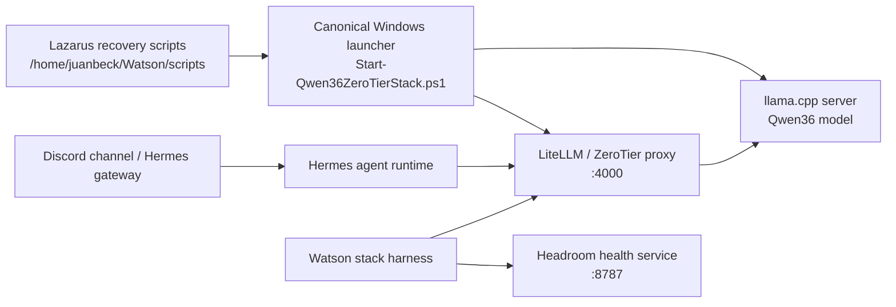

# Watson stack architecture

Date: 2026-06-25

## Purpose

This document describes the runtime architecture used for Watson/Hermes local inference through the ZeroTier LLM proxy repo. It is intentionally organized like the NAO architecture docs: contracts first, runtime topology second, validation artifacts last.

## Runtime contract

The canonical launcher is:

```powershell
C:\Users\Admin\PROJECTS\zerotier-llm-proxy\scripts\windows\Start-Qwen36ZeroTierStack.ps1
```

Lazarus must call that launcher for stack recovery and context reruns. It should not start an independent WSL LiteLLM process or bypass the Windows launcher.

Required launcher behavior:

- Start or reuse the llama.cpp server only when the loaded model and requested context match.
- Restart llama.cpp if `/v1/models` reports the right alias but the wrong `meta.n_ctx`.
- Keep LiteLLM/ZeroTier proxy ownership on the Windows side.
- Expose the OpenAI-compatible API to WSL through the Windows host address, currently `http://172.24.16.1:4000/v1`.

## Component topology



## Stability findings from takeover

- Hermes Discord import failure was a stale long-running gateway module cache issue after updating Hermes. The installed `utils.py` already contained `env_float`; restarting the Hermes gateway refreshed the module graph.
- The previous Lazarus health path could report success against a live 65k model even when a higher context was requested. The Windows launcher now checks the loaded model context before declaring readiness.
- A 128k context can load. The practical usability issue is prefill time, not just loadability.
- A synthetic 80k prompt held the GPU busy for several minutes without returning an interactive response. The stable default should remain 65k until prefill measurements justify a higher default.

## Context and throughput model

Increasing `n_ctx` mainly changes two things:

1. It increases KV-cache memory reservation and reduces VRAM headroom.
2. It allows longer prompts, which increases prefill work before the first output token.

Short prompts do not become twice as slow merely because `n_ctx` is raised from 65k to 128k. The actual prompt length drives most of the prefill cost. Long prompts do affect decode too, because each generated token attends over a larger existing context, but the user-visible pain in Discord is usually time-to-first-token.

## Validation boundary

Use these checks as separate gates:

- Load gate: `/v1/models` reports the requested alias and `meta.n_ctx`.
- Smoke gate: `scripts/windows/Test-Qwen36Proxy.ps1` returns `qwen36 proxy ok`.
- Functional gate: Watson harness returns a valid chat completion and valid tool-fidelity JSON.
- Usability gate: prefill time and time-to-first-token stay acceptable for Discord interaction.

The first three gates can pass while the fourth fails.
